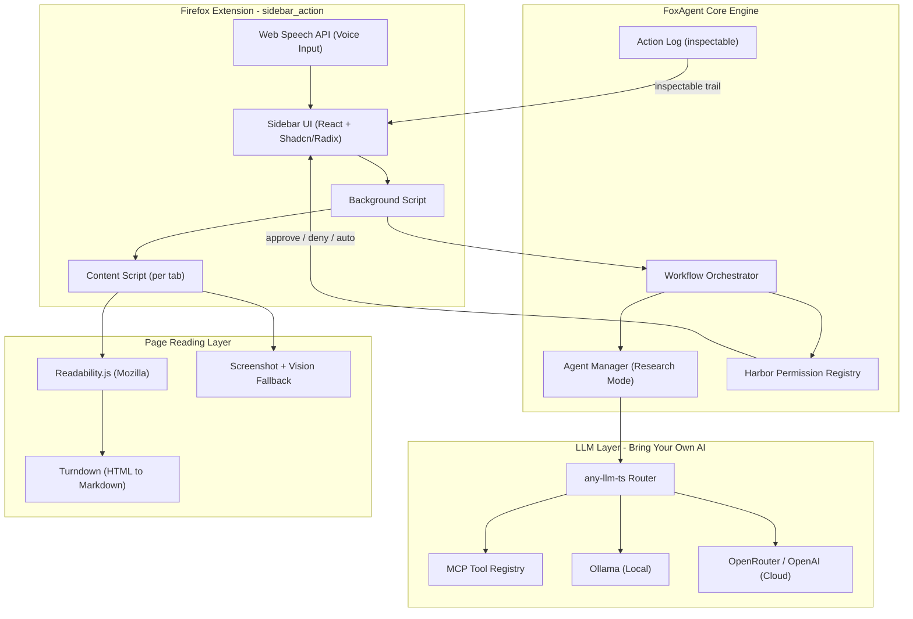
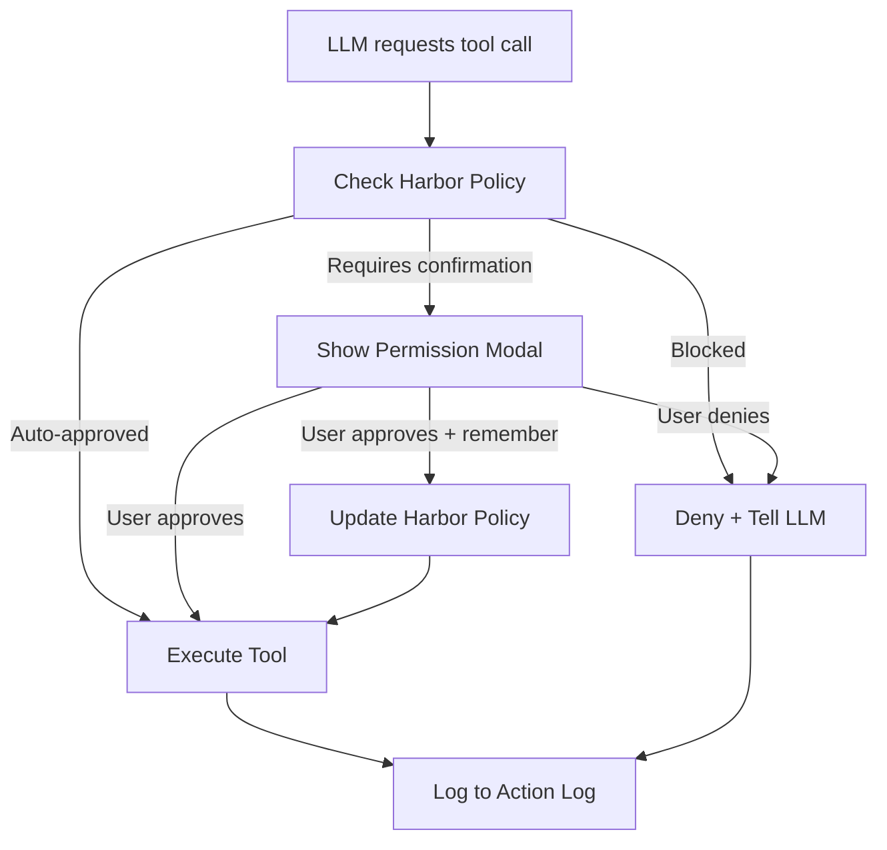

# FoxAgent - The Universal Web Agent (Browser Operating System)

> Not a chatbot. A Browser Operating System.

> Runs locally. User-controlled. Permission-mediated.

## Architecture Overview



## Tech Stack (Mozilla-Aligned)

| Layer | Technology | Why |

|-------|-----------|-----|

| Browser | Firefox Developer Edition | Mozilla-native, sidebar_action API, privacy-first |

| LLM Abstraction | [any-llm-ts](https://github.com/r/any-llm-ts) | Swap GPT-4o (cloud) and Llama-3 (local) instantly |

| Local LLM | [Ollama](https://ollama.ai) @ localhost:11434 | Privacy, no API costs, runs offline |

| Cloud Fallback | OpenRouter API key | Access any cloud model when needed |

| Tooling Protocol | MCP (Model Context Protocol) | Industry standard for AI-to-system connections |

| Page Reading | [Readability.js](https://github.com/mozilla/readability) (Mozilla) | Strips junk, extracts pure article content |

| HTML to Markdown | [Turndown](https://github.com/mixmark-io/turndown) | Clean markdown for LLM context |

| UI Framework | React 18 + [Shadcn/ui](https://ui.shadcn.com/) + Radix UI | Accessible, clean sidebar components |

| Voice Input | Web Speech API (browser-native) | Free, zero-cost, no external dependencies |

| Build | Vite + web-ext | Fast builds, Firefox extension hot reload |

| State | Zustand | Lightweight, works in extension context |

| Storage | browser.storage.local | Persist Harbor config, API keys, memory |

## Three Core Features (Use Cases)

| Feature | Tier | What It Does |

|---------|------|-------------|

| Voice-Native Navigation | Tier 1-2 | "Find the refund policy and summarize it." No clicking required. Uses free Web Speech API. |

| Intelligent Summarization | Tier 1-2 | Readability.js strips page junk, Turndown converts to markdown, LLM summarizes. Works on any site. |

| Cross-Site Research Mode | Tier 3 | "Find a hotel in Tokyo" - opens Booking, Expedia, Airbnb, reads all three, presents comparison table. |

## Capability Tiers Mapped to FoxAgent

| Tier | SDK Capability | FoxAgent Implementation |

|------|---------------|------------------------|

| Tier 1 | LLM + MCP tool calling | any-llm-ts router + MCP tool registry + Harbor allowlist |

| Tier 2 | Browser context + page interaction | Readability.js reading + click/fill/scroll actions + visual highlighter |

| Tier 3 | Multi-agent coordination | Research Mode: multiple agents with distinct roles across tabs |

---

## Sprint 1: "The Mozilla Setup" - Foundation (Hours 0-5)

**Goal:** A Firefox sidebar extension that talks to any LLM using any-llm-ts. Basic chat working.

### 1.1 Firefox Extension Scaffold

Create `manifest.json` with Firefox-specific sidebar_action:

```json
{
  "manifest_version": 2,
  "name": "FoxAgent",
  "version": "1.0.0",
  "description": "Bring Your Own AI to Every Website",
  "sidebar_action": {
    "default_title": "FoxAgent",
    "default_panel": "sidebar.html",
    "default_icon": "icons/fox-48.png"
  },
  "permissions": [
    "activeTab",
    "scripting",
    "storage",
    "tabs",
    "<all_urls>"
  ],
  "background": {
    "scripts": ["src/background/index.js"],
    "type": "module"
  },
  "content_scripts": [{
    "matches": ["<all_urls>"],
    "js": ["src/content/index.js"],
    "run_at": "document_idle"
  }],
  "icons": {
    "48": "icons/fox-48.png",
    "96": "icons/fox-96.png"
  }
}
```

### 1.2 Integrate any-llm-ts

Build a `ModelService.ts` that wraps the any-llm library:

- User can paste an **OpenRouter API key** (cloud models)
- OR point to `http://localhost:11434` (Ollama local)
- Model selector dropdown: GPT-4o, Claude, Llama-3, Mistral, etc.

### 1.3 Sidebar Chat UI

Build with React + Shadcn/Radix:

- Settings tab: API key input, model selector, Ollama toggle
- Chat tab: message input, response display, markdown rendering
- Voice button (placeholder for Sprint 2)

### 1.4 Background Script + Message Passing

Set up `browser.runtime.onMessage` / `browser.runtime.sendMessage` bridge:

- Sidebar sends chat messages to background
- Background calls LLM via any-llm-ts
- Background streams responses back to sidebar
- Content script stub injected into all pages

### 1.5 Test

Open Firefox Dev Edition, load extension, type "Who are you?" in sidebar, get response.

**Deliverable:** Working Firefox sidebar that chats with your own LLM (local or cloud).

---

## Sprint 2: "The Eyes + Voice" - Reading and Speaking (Hours 5-10)

**Goal:** FoxAgent sees web pages via Readability.js, summarizes them, and accepts voice input.

### 2.1 Inject Readability.js + Turndown

Content script flow:

1. Inject Mozilla's Readability.js into the active page
2. Extract clean article content (title, byline, content, text content)
3. Pipe HTML content through Turndown to get markdown
4. Send markdown to background script
```typescript
// content/dom-reader.ts
import { Readability } from '@mozilla/readability';
import TurndownService from 'turndown';

function readPage(): PageContent {
  const doc = document.cloneNode(true) as Document;
  const article = new Readability(doc).parse();

  if (article && article.textContent.length > 50) {
    const turndown = new TurndownService();
    return {
      title: article.title,
      markdown: turndown.turndown(article.content),
      source: 'readability'
    };
  }

  // Fallback: lightweight extraction
  return {
    title: document.title,
    markdown: extractBasicContent(),
    source: 'fallback'
  };
}
```


### 2.2 Vision Fallback

When Readability returns < 50 words (heavy JS/SPA sites):

- Use `browser.tabs.captureVisibleTab()` to take a screenshot
- Send screenshot to a vision-capable model (GPT-4o-mini or Gemini Flash via OpenRouter)
- This is cheap: ~$0.001 per screenshot

### 2.3 Summarization Feature

Add a "Summarize This Page" button in the sidebar:

1. Click button (or voice command)
2. Content script reads page via Readability + Turndown
3. Markdown sent to LLM with system prompt: "You are FoxAgent. Summarize the following page content concisely."
4. Summary displayed in sidebar with source attribution

### 2.4 Voice-Native Navigation (Web Speech API)

Use the browser's built-in `webkitSpeechRecognition` / `SpeechRecognition` - completely free:

```typescript
// sidebar/hooks/useVoiceInput.ts
function useVoiceInput() {
  const recognition = new (window.SpeechRecognition ||
    window.webkitSpeechRecognition)();
  recognition.continuous = false;
  recognition.interimResults = true;
  recognition.lang = 'en-US';

  const startListening = () => {
    recognition.start();
    recognition.onresult = (event) => {
      const transcript = event.results[0][0].transcript;
      // Feed transcript to FoxAgent as a chat message
      sendToAgent(transcript);
    };
  };
  return { startListening };
}
```

Add a microphone button to the sidebar. Hold to speak, release to send.

### 2.5 Context Injection

Update the system prompt sent to the LLM:

```
You are FoxAgent, a browser operating system. You help users navigate and understand the web.

Current tab: {url}
Page content (markdown):
{readability_markdown}

User request: {user_message}
```

**Deliverable:** Say "Summarize this page" via voice or text. FoxAgent reads the page with Readability, converts to markdown, and returns a clean summary.

---

## Sprint 3: "The Hands" - MCP Tool Actions (Hours 10-15)

**Goal:** FoxAgent can act on pages: click, fill forms, scroll, navigate. All actions go through Harbor.

### 3.1 Define MCP Tool Registry

Create `harbor_tools.json` - the tool definitions following MCP standard:

```typescript
// lib/tool-registry.ts
const TOOLS: MCPTool[] = [
  {
    name: 'read_page',
    description: 'Read the current page content using Readability',
    parameters: {},
    permission: 'read-only',
    handler: readPageHandler
  },
  {
    name: 'click_element',
    description: 'Click an element on the page',
    parameters: { selector: 'string', description: 'string' },
    permission: 'interact',
    handler: clickHandler
  },
  {
    name: 'fill_form',
    description: 'Type text into an input field',
    parameters: { selector: 'string', text: 'string' },
    permission: 'interact',
    handler: fillHandler
  },
  {
    name: 'navigate',
    description: 'Navigate to a URL in current or new tab',
    parameters: { url: 'string', newTab: 'boolean' },
    permission: 'navigate',
    handler: navigateHandler
  },
  {
    name: 'scroll',
    description: 'Scroll the page up or down',
    parameters: { direction: '"up" | "down"' },
    permission: 'read-only',
    handler: scrollHandler
  },
  {
    name: 'summarize_page',
    description: 'Read and summarize the current page',
    parameters: {},
    permission: 'read-only',
    handler: summarizeHandler
  }
];
```

### 3.2 Implement Action Content Scripts

Content script handlers for each tool:

- `click_element(selector)`: Find element, scroll into view, click
- `fill_form(selector, text)`: Find input, focus, type character by character
- `scroll(direction)`: Scroll viewport up/down
- All actions dispatched via `browser.tabs.sendMessage`

### 3.3 Visual Highlighter (Key Differentiator)

Before any click or interaction, draw a bright red/orange pulsing border around the target element for 1.5 seconds so the user SEES what the AI is targeting:

```typescript
// content/visual-highlighter.ts
function highlightElement(selector: string): void {
  const el = document.querySelector(selector);
  if (!el) return;
  el.scrollIntoView({ behavior: 'smooth', block: 'center' });
  const overlay = document.createElement('div');
  overlay.className = 'foxagent-highlight';
  // Position overlay exactly over element
  // Bright orange border, pulsing animation
  // Auto-remove after 1.5s
}
```

### 3.4 Tool Calling Loop

Implement the LLM tool-calling loop in the background script:

1. Send user message + page context + available tools to LLM
2. LLM responds with a tool call (or text)
3. Check Harbor registry - is this tool allowed on this site?
4. If allowed: execute tool, get result, feed back to LLM
5. If denied: show permission prompt in sidebar
6. Repeat until LLM responds with final text

**Deliverable:** Say "Click the first search result" or "Fill in my name on this form". FoxAgent highlights the element, requests permission, then acts.

---

## Sprint 4: "Harbor" - The Safety and Customization Layer (Hours 15-20)

**Goal:** Full Harbor permission UI. This is the core judging differentiator.

### 4.1 Harbor Permission Data Model

```typescript
// lib/harbor-types.ts
interface HarborPolicy {
  // Site-level trust
  trustedSites: {
    [domain: string]: {
      trustLevel: 'blocked' | 'read-only' | 'navigate' | 'interact' | 'full';
      autoApprove: string[];    // tool names auto-approved
      requireConfirm: string[]; // tool names requiring confirmation
      expiresAt?: number;       // time-bounded trust
    }
  };

  // Tool-level control
  toolOverrides: {
    [toolName: string]: {
      enabled: boolean;
      globalAutoApprove: boolean;
    }
  };

  // Global settings
  defaults: {
    readOnly: 'auto-approve' | 'ask';
    navigate: 'auto-approve' | 'ask';
    interact: 'ask' | 'deny';
    submit: 'ask' | 'deny';
    criticalActions: string[];   // e.g., "checkout", "delete", "send"
  };
}
```

Stored in `browser.storage.local` as JSON.

### 4.2 Permission Interception Flow

Every tool call goes through this pipeline:



### 4.3 Permission Modal UI

When a tool call needs confirmation, show an overlay in the sidebar:

- **What**: "FoxAgent wants to click 'Add to Cart' on amazon.com"
- **Why**: "This was requested as part of your shopping workflow"
- **Permission Level**: interact (orange badge)
- **Options**:
  - [Allow Once] - one-time approval
  - [Allow for This Site] - remember for this domain
  - [Allow for This Session] - expires when tab closes
  - [Deny] - block and tell the agent
  - [Deny All Interactions] - disable interact tools globally

### 4.4 Action Log

Visible "Activity" tab in sidebar showing every action with:

- Timestamp
- Tool name + parameters
- Target site
- Permission level used (color-coded: green=read, yellow=navigate, orange=interact, red=submit)
- Result (success/denied/error)
- Expandable detail view

### 4.5 Settings Tab - User Customization

- **Model Config**: API key, model selection, Ollama endpoint
- **Harbor Config**: Default trust levels, per-site overrides
- **Custom System Prompt**: e.g., "Always summarize in bullet points" or "I prefer budget options"
- **Tool Toggles**: Enable/disable individual tools globally
- **Privacy Mode**: Disable all cloud calls, Ollama-only

### 4.6 Critical Action Detection

Heuristic to detect dangerous actions:

- Button text contains "checkout", "purchase", "delete", "send", "submit", "confirm"
- Form action points to payment/checkout URL
- These ALWAYS require explicit confirmation, regardless of Harbor policy

**Deliverable:** A full Harbor permission system with visual modal, action log, per-site trust, and critical action detection.

---

## Sprint 5: Research Mode - Cross-Site Orchestration + Demo (Hours 20-24)

**Goal:** The "wow factor" - multi-tab Research Mode + polished demo.

### 5.1 Research Mode Agent

A specialized orchestration mode:

```typescript
// agents/research-agent.ts
interface ResearchPlan {
  intent: string;
  steps: ResearchStep[];
}

interface ResearchStep {
  agent: string;
  task: string;
  site: string;
  tabId?: number;
  permissions: string[];
  dependsOn?: string[];
  result?: any;
}
```

User says: "Find a hotel in Tokyo for March 15-20, check if I have calendar conflicts, and draft an email to my travel group."

FoxAgent creates a plan:

1. **SearchAgent** - Open Booking.com, search Tokyo hotels March 15-20, extract top 5
2. **SearchAgent** - Open Expedia, same search, extract top 5
3. **CalendarAgent** - Open Google Calendar, check March 15-20 for conflicts
4. **CompareAgent** - Merge results, rank by price and rating
5. **EmailAgent** - Open Gmail, draft email with comparison table + calendar status

### 5.2 Multi-Tab Execution

```typescript
// background/orchestrator.ts
async function executeResearchPlan(plan: ResearchPlan) {
  for (const step of plan.steps) {
    // Show current step in sidebar UI
    updateSidebarProgress(step);

    // Check Harbor permissions for target site
    const permission = await harbor.checkSitePermission(step.site);
    if (permission === 'blocked') {
      step.result = { error: 'Site blocked by Harbor policy' };
      continue;
    }

    // Open tab for this step
    const tab = await browser.tabs.create({ url: step.site, active: true });
    await waitForPageLoad(tab.id);

    // Inject content script, read page
    const pageContent = await readPageContent(tab.id);

    // Execute step with scoped agent
    step.result = await executeAgentStep(step, pageContent);

    // Pass context to next step if needed
    if (step.dependsOn) {
      injectContextFromPreviousSteps(step, plan);
    }
  }

  // Present final comparison in sidebar
  return aggregateResults(plan);
}
```

### 5.3 Workflow Progress UI

In the sidebar, show a visual workflow tracker:

- Each step as a card with status (pending / running / done / error)
- Current step highlighted with spinner
- Completed steps show extracted data summary
- User can click any step to see full details
- [Pause] [Resume] [Cancel] buttons at the top

### 5.4 Demo Scenarios (Live Sites, No Mocks)

**Demo 1: Summarization** (30 seconds)

- Open a messy news article on CNN/BBC
- Click "Summarize" or say "Summarize this page"
- FoxAgent reads via Readability, strips junk, returns clean summary

**Demo 2: Voice Navigation** (30 seconds)

- On Amazon product page
- Say "What is the return policy for this product?"
- FoxAgent reads page, finds policy section, summarizes it

**Demo 3: Harbor Safety** (30 seconds)

- On Amazon, say "Add this to my cart"
- Harbor modal appears: "FoxAgent wants to click 'Add to Cart' on amazon.com"
- Show the visual highlighter on the button
- Approve, then see it logged in Action Log

**Demo 4: Research Mode** (60 seconds)

- Say "Compare hotels in Tokyo for next week"
- Plan appears in sidebar with 3-4 steps
- Confirm plan
- Watch FoxAgent open tabs, read each site, aggregate results
- Final comparison table in sidebar

### 5.5 Polish

- Smooth animations on permission modals
- Loading states and error handling
- Harbor "quick settings" from sidebar header
- README.md for the GitHub repo
- Record demo video

**Deliverable:** End-to-end FoxAgent demo showing all 3 features + Harbor safety on live websites.

---

## File Structure

```
foxagent/
  manifest.json                  # Firefox extension manifest v2
  package.json                   # Dependencies
  vite.config.ts                 # Vite + web-ext build config
  tsconfig.json
  tailwind.config.ts
  icons/
    fox-48.png
    fox-96.png
  src/
    background/
      index.ts                   # Background script entry
      orchestrator.ts            # Workflow orchestrator
      agent-manager.ts           # Multi-agent (Research Mode)
      message-handler.ts         # Message routing
    content/
      index.ts                   # Content script entry
      dom-reader.ts              # Readability.js + Turndown extraction
      page-actions.ts            # click, fill, scroll, navigate
      visual-highlighter.ts      # Red box highlight before actions
      vision-fallback.ts         # Screenshot capture for SPA sites
    sidebar/
      index.html                 # Sidebar HTML entry
      main.tsx                   # React entry
      App.tsx                    # Root app with tab navigation
      components/
        Chat.tsx                 # Chat interface
        VoiceButton.tsx          # Web Speech API microphone button
        SummarizeButton.tsx      # One-click summarize
        WorkflowPlan.tsx         # Research Mode step visualization
        PermissionModal.tsx      # Harbor approval dialog
        ActionLog.tsx            # Action history (inspectable)
        Settings.tsx             # API key, model, Harbor config
        HarborManager.tsx        # Per-site trust level manager
      hooks/
        useVoiceInput.ts         # Web Speech API hook
        useLLM.ts                # LLM communication hook
        useHarbor.ts             # Harbor policy hook
      stores/
        chat-store.ts            # Zustand chat state
        harbor-store.ts          # Zustand Harbor policy state
        workflow-store.ts        # Zustand workflow state
    lib/
      any-llm-router.ts          # any-llm-ts wrapper (cloud + local)
      mcp-tool-registry.ts       # MCP tool definitions + calling loop
      harbor-engine.ts           # Permission checking logic
      types.ts                   # Shared TypeScript types
      messaging.ts               # browser.runtime message helpers
      constants.ts               # Config constants
    agents/
      search-agent.ts            # Web search and comparison
      calendar-agent.ts          # Calendar reading
      email-agent.ts             # Email drafting
      summarize-agent.ts         # Page summarization specialist
```

## Scoring Alignment (Evaluation Criteria)

| Criteria | How FoxAgent Addresses It | Score Lever |

|----------|--------------------------|-------------|

| **Execution Boundaries** | Harbor registry defines exactly what each tool can do. Each agent has scoped site access. Actions logged. | Harbor is the dedicated answer |

| **Browser Context** | Readability.js for clean content. Vision fallback for SPAs. Context flows as markdown, not raw HTML. | Mozilla's own library = brownie points |

| **Permission Design** | Per-site trust levels, per-tool toggles, time-bounded sessions, critical action detection. Auto-approve reads, confirm writes. | Most detailed permission model in the competition |

| **Legibility and User Control** | Visual highlighter shows what AI targets. Action log is inspectable. Workflow steps are pausable/cancellable. | User sees everything before it happens |

| **Judgment and Restraint** | Email drafted not sent. Cart shown not purchased. "Checkout" always blocked by default. Limitations acknowledged in UI. | Conservative defaults, user escalates |

| **Bonus: New Questions** | What happens when Readability fails? When should voice permissions differ from text? Should Research Mode have a "budget" of tabs? | Surfaces real edge cases |

## Why This Wins

1. **Mozilla-Native**: Firefox browser, Readability.js (Mozilla's library), privacy-first local AI
2. **Harbor is the Story**: A dedicated, named permission system that judges can point to and discuss
3. **Voice is Free**: Web Speech API costs nothing, adds accessibility narrative
4. **Research Mode is the Wow**: Multi-tab orchestration is the Tier 3 differentiator
5. **Live Data**: Demoed on real Amazon, Wikipedia, Google Calendar - no mocks
6. **Local-First**: Ollama means the agent works offline, data never leaves the machine